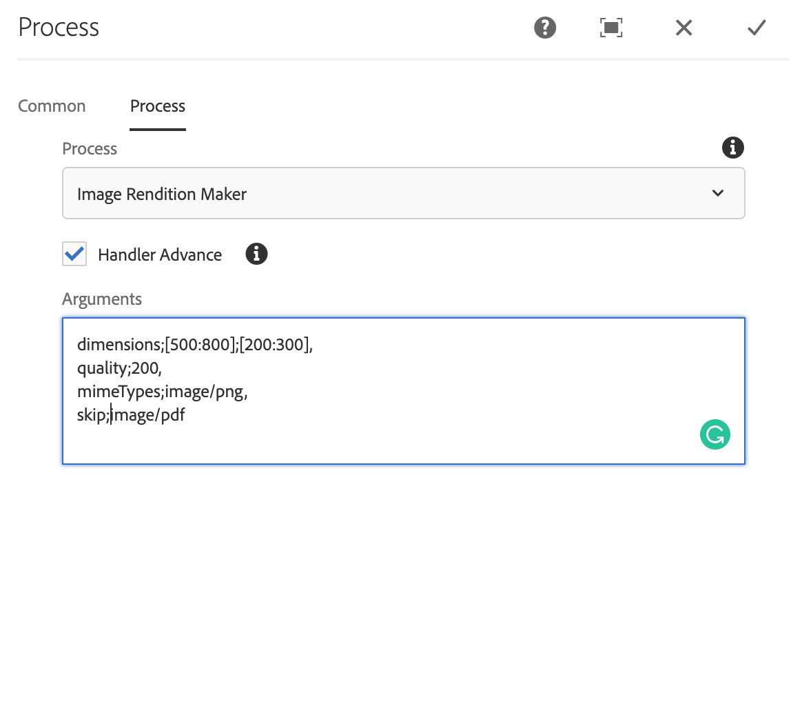
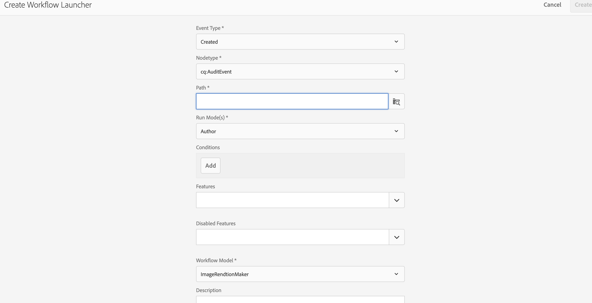

# AEM DAM RENDTION WORKFLOW

Copy the process step created using OSGI R6 Annotation

Add the following arguments as per JAVA code

Create a launcher and provide the path to DAM Asset folder
and select the Model (In this example Image Rendition Maker)

